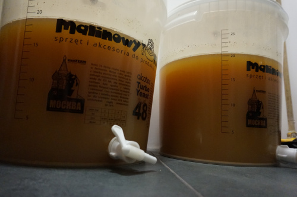

# Apple cider

## Ingredients:
* 10 l NFC apple juice (either store bought or squeezed out by yourself)
* Cider yeast (can be substituted by universal yeast or even wine yeast)
* 80 g sugar
* Optional: 100 g erythritol

## Instructions:
**Prepare the yeast**: According to instructions on packaging.

**Prepare the juice**: Pour the juice into a sterilized plastic fermantator or a large glass jug. In any case, make sure the container is a few liters larger than the amount of juice you're using. Add your yeast.

**Set aside**: Close the lid tightly, insert your fermentation airlock and add a few drops of water to seal it. Keep the container in a dark and warm place but keep in mind that the contents might spill out during fermentation, especially if you leave insufficient space in the container or if you're using homemade juice.

**Fermentation**:
Leave the container for a week: But pay attention to the process. On day two your cider will begin producing gas which will be easy to notice due to the sound made by the airlock. When the sounds stop altogether after a few days, you can assume all sugar has been consumed and the fermentation is finished.

**Second fermentation**: In order to carbonate your drink, add 8 g sugar per 100 ml before bottling.

**Optional**: Sweeten your cider with erythritol: Your cider is going to be sour and savory by default, as all the sugar it contains is consumed by the yeast. In order to sweeten the drink, add a sweetener. You can try different proportions by yourself, otherwise try to add 10 g per 100 ml in a small portion of the cider and see if you like the result. Adjust as needed.

**Transfer the cider to glass bottles:** But first set the mixture aside to let the sediment fall to the bottom of the container after stirring it. Pour the cider into glass bottles and seal them tightly. After two weeks your cider should be ready to drink, however setting it aside for a while longer will enrich the flavour and enhance the carbonation.

Bon appetit!